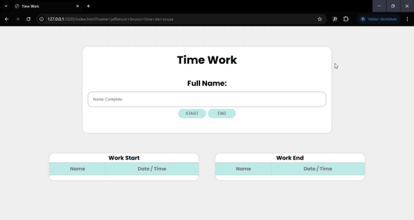

# Time Work - Sistema de Controle de Ponto Simples e Funcional!

Hoje compartilho com vocês um projeto que desenvolvi com foco na praticidade para registrar o horário de entrada e saída de colaboradores de forma rápida, organizada e visualmente clara.

## 🧠 Tecnologias utilizadas:

- HTML5  
- CSS3 (com responsividade e estilo moderno)  
- JavaScript puro (sem frameworks)  

## Funcionalidades:

- ✅ Registro de entrada e saída com nome do funcionário  
- ✅ Tabelas separadas para controle visual  
- ✅ Modal de confirmação antes de registrar (evita erros)  
- ✅ Estilo visual: hora da entrada em verde e da saída em vermelho  
- ✅ Horário atualizado automaticamente com a data e hora atual do sistema  

## 📸 Destaques técnicos:

- Manipulação de DOM com `createElement`, `appendChild`, `addEventListener`  
- Uso de `new Date().toLocaleTimeString()` e `toLocaleDateString()` para horário formatado  

---

Projeto ideal para pequenas empresas, startups ou até mesmo squads de TI que querem acompanhar seus horários de forma leve e sem burocracia.

> Em breve, novas versões com banco de dados e exportação!

📁 GitHub: [https://github.com/brunolimagit/cadastro-entrada-saida](https://github.com/brunolimagit/cadastro-entrada-saida)

---

**Tags:**  
#javascript #frontend #webdevelopment #project #html #css #controledeponto #uidevelopment #programacao
Como usar